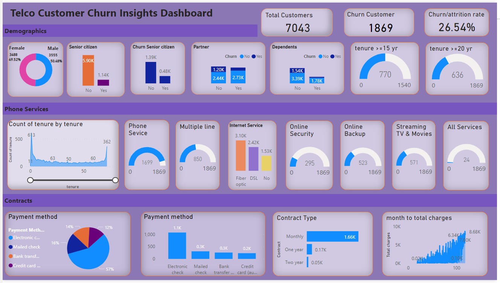

# PowerBI_Dashboard Customer Churn Analysis

Presenting below Customer Churn analysis Dashboard using a telecom dataset from Kaggle.

I have used Power query editor, different charts like bar, stack, donut chart, gauge, slicer, zoom slider, line chart, DAX queries, & a lot more.
It was amazing getting hands-on with the DAX query.

Moving over to the Dataset,
We have features like - Gender, Senior Citizen, Partner, Tenure, Phone Services, Multiple Lines, Internet Service, Online Security, Online Backup, Streaming TV & Movies, Payment Method, Contract Type, Total Charge, etc.

I have got a lot of insights & information on the present Customer.
Mainly focused on three categories - 1.) Demographics, 2.) Phone Services 4.) Contracts

I am majorly trying to focus on the insights that can be driven out of the churning customers, the type of services they use & payment related other details.

